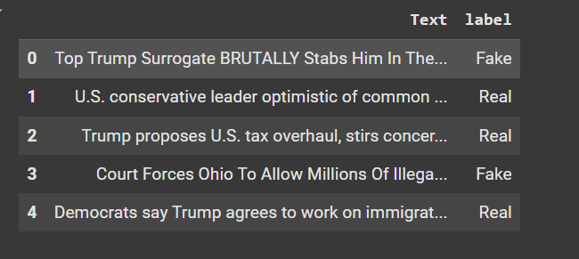
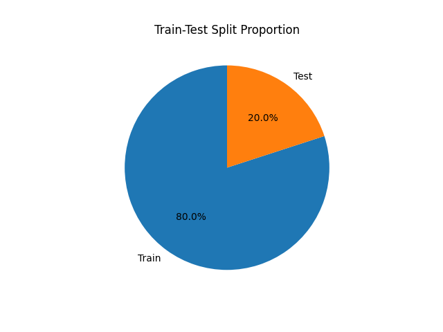

# Fake News Detection Model

This project uses machine learning techniques to classify news articles as either *real* or *fake* based on text data. Leveraging Natural Language Processing (NLP) techniques and a machine learning classifier, this model helps in identifying misinformation from reliable news sources.

## Overview
The model uses the **TF-IDF** (Term Frequency-Inverse Document Frequency) vectorization method to convert text data into numerical features and a **Linear Support Vector Classifier (LinearSVC)** to classify news articles. With an accuracy of approximately 99%, this model provides a solid baseline for detecting fake news.

## Dataset
The dataset consists of two classes:
- **Real**: Legitimate news articles
- **Fake**: Misinformation or unreliable news articles

The data includes:
- **Text**: The news article text.
- **Label**: The classification label (Real/Fake).

### Data Distribution
A bar chart visualizing class distribution is provided to show the balance between real and fake news articles in the dataset.

## Dependencies
To run this project, ensure you have the following libraries installed:
- `pandas`
- `scikit-learn`
- `seaborn`
- `matplotlib`

Install dependencies using:
```bash
pip install -r requirements.txt
```
## Model Training and Evaluation

1. TF-IDF Vectorization: Converts the article text into a numerical format suitable for machine learning.
2. Model Training: A LinearSVC model is trained on the vectorized data.
3. Evaluation: The model is evaluated using accuracy and classification metrics, along with a confusion matrix for visual representation.

# Key Code Sections:
**Import required librariess**

```bash
import pandas as pd
from sklearn.model_selection import train_test_split
from sklearn.feature_extraction.text import TfidfVectorizer
from sklearn.svm import LinearSVC
from sklearn.metrics import accuracy_score, classification_report, confusion_matrix
import matplotlib.pyplot as plt
import seaborn as sns
```
### Data Loading:
```bash
# Load dataset
df = pd.read_csv('/content/fake_and_real_news.csv')
```
**Dataset Size Check**
 df.shape, shows the dimensions of the dataset (number of rows and columns). It helps us understand the dataset's size.
 ```bash
df.shape
 ```
output: (9900, 2) #9900 data and 2 column 

**First five row:**



## Splitting Data for Training and Testing
This code splits the data into training and testing sets, with 80% for training and 20% for testing. The split is done randomly, but the random_state=0 ensures consistent results each time.

```bash
from sklearn.model_selection import train_test_split
X_train,X_test,Y_train,Y_test=train_test_split(X,Y,test_size=0.2,random_state=0)
```
Display a pie chart showing the percentage of data used for training and testing, helping you visualize the split.

```bash
import matplotlib.pyplot as plt

# Plot the proportion of training and testing data
labels = ['Train', 'Test']
sizes = [len(X_train), len(X_test)]
plt.pie(sizes, labels=labels, autopct='%1.1f%%', startangle=90)
plt.title('Train-Test Split Proportion')
plt.savefig('/content/train_test_split.png')
plt.show()
```



### TF-IDF Transformation:
```bash
vectorizer = TfidfVectorizer(max_features=5000)
X_train_tfidf = vectorizer.fit_transform(X_train['Text'])
X_test_tfidf = vectorizer.transform(X_test['Text'])
```
##Label Slicing
This code selects parts of the dataset:\
X takes the first column (probably the news text). Y takes the last column (likely the labels, like real or fake).
```bash
X=df.iloc[:,0:1]
Y=df.iloc[:,-1]
```
This code creates a bar chart to show how many real and fake news articles are in the dataset. It counts the labels in Y and displays the result with labels for clarity
```bash
import matplotlib.pyplot as plt

Y.value_counts().plot(kind='bar')
plt.title('Class Distribution (Real vs. Fake)')
plt.xlabel('Class')
plt.ylabel('Count')
plt.show()
```
### Model Training and Prediction
```bash
clf = LinearSVC(random_state=0)
clf.fit(X_train_tfidf, Y_train)
Y_pred = clf.predict(X_test_tfidf)
```
### Evaluation
```bash
accuracy = accuracy_score(Y_test, Y_pred)
print("Accuracy:", accuracy)
print(classification_report(Y_test, Y_pred))
```
### Confusion Matrix:
```bash
cm = confusion_matrix(Y_test, Y_pred)
sns.heatmap(cm, annot=True, fmt='d', cmap='coolwarm', xticklabels=['Fake', 'Real'], yticklabels=['Fake', 'Real'])
plt.title('Confusion Matrix')
plt.xlabel('Predicted')
plt.ylabel('True')
plt.show()
```
## How to Use
1. **Clone this repository:**
```bash
git@github.com:TaskiyaMridha/Fake_news_Classification.git
```
2. **Navigate to the project directory:**
```bash
cd fake_news_detection
```
3. **Install dependancies:**
```bash
pip install -r requirements.txt
```
4. **Run the notebook or script to load the dataset, train the model, and evaluate its performance.**

## Future Improvements

* Experiment with additional models like Random Forest or Naive Bayes.
* Use more complex NLP techniques, like word embeddings, to improve classification accuracy.
* Explore ensemble models for potential accuracy improvements.
